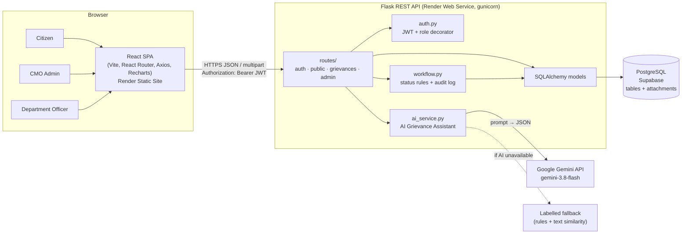

# System Architecture Diagram

Rendered automatically by GitHub (Mermaid).

```mermaid
flowchart LR
    subgraph Client["Browser"]
        U1[Citizen]
        U2[CMO Admin]
        U3[Department Officer]
        SPA["React SPA<br/>(Vite, React Router, Axios, Recharts)<br/>Render Static Site"]
        U1 & U2 & U3 --> SPA
    end

    subgraph Server["Flask REST API (Render Web Service, gunicorn)"]
        AUTH["auth.py<br/>JWT + role decorator"]
        ROUTES["routes/<br/>auth · public · grievances · admin"]
        WF["workflow.py<br/>status rules + audit log"]
        AI["ai_service.py<br/>AI Grievance Assistant"]
        ORM["SQLAlchemy models"]
        ROUTES --> AUTH
        ROUTES --> WF
        ROUTES --> AI
        ROUTES --> ORM
        WF --> ORM
    end

    DB[("PostgreSQL<br/>Supabase<br/>tables + attachments")]
    LLM["Google Gemini API<br/>gemini-3.8-flash"]
    FB["Labelled fallback<br/>(rules + text similarity)"]

    SPA -- "HTTPS JSON / multipart<br/>Authorization: Bearer JWT" --> ROUTES
    ORM --> DB
    AI -- "prompt → JSON" --> LLM
    AI -. "if AI unavailable" .-> FB
```
