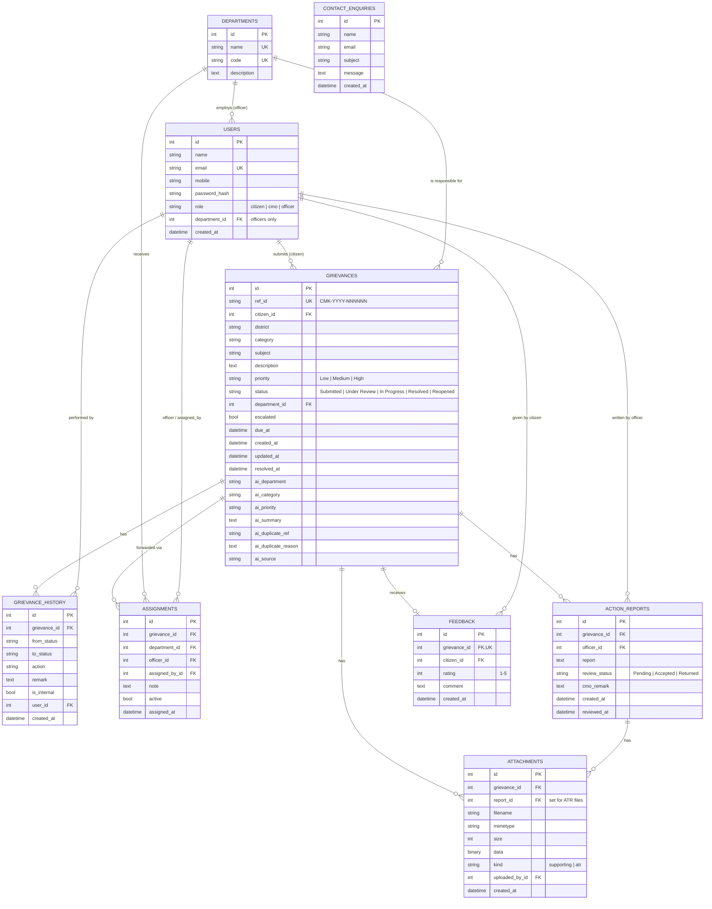

# Database ER Diagram

Rendered automatically by GitHub (Mermaid).

```mermaid
erDiagram
    USERS ||--o{ GRIEVANCES : "submits (citizen)"
    DEPARTMENTS ||--o{ USERS : "employs (officer)"
    DEPARTMENTS ||--o{ GRIEVANCES : "is responsible for"
    GRIEVANCES ||--o{ GRIEVANCE_HISTORY : "has"
    USERS ||--o{ GRIEVANCE_HISTORY : "performed by"
    GRIEVANCES ||--o{ ASSIGNMENTS : "forwarded via"
    DEPARTMENTS ||--o{ ASSIGNMENTS : "receives"
    USERS ||--o{ ASSIGNMENTS : "officer / assigned_by"
    GRIEVANCES ||--o{ ATTACHMENTS : "has"
    ACTION_REPORTS ||--o{ ATTACHMENTS : "has"
    GRIEVANCES ||--o{ ACTION_REPORTS : "has"
    USERS ||--o{ ACTION_REPORTS : "written by officer"
    GRIEVANCES ||--o| FEEDBACK : "receives"
    USERS ||--o{ FEEDBACK : "given by citizen"

    USERS {
        int id PK
        string name
        string email UK
        string mobile
        string password_hash
        string role "citizen | cmo | officer"
        int department_id FK "officers only"
        datetime created_at
    }
    DEPARTMENTS {
        int id PK
        string name UK
        string code UK
        text description
    }
    GRIEVANCES {
        int id PK
        string ref_id UK "CMK-YYYY-NNNNNN"
        int citizen_id FK
        string district
        string category
        string subject
        text description
        string priority "Low | Medium | High"
        string status "Submitted | Under Review | In Progress | Resolved | Reopened"
        int department_id FK
        bool escalated
        datetime due_at
        datetime created_at
        datetime updated_at
        datetime resolved_at
        string ai_department
        string ai_category
        string ai_priority
        text ai_summary
        string ai_duplicate_ref
        text ai_duplicate_reason
        string ai_source
    }
    GRIEVANCE_HISTORY {
        int id PK
        int grievance_id FK
        string from_status
        string to_status
        string action
        text remark
        bool is_internal
        int user_id FK
        datetime created_at
    }
    ASSIGNMENTS {
        int id PK
        int grievance_id FK
        int department_id FK
        int officer_id FK
        int assigned_by_id FK
        text note
        bool active
        datetime assigned_at
    }
    ATTACHMENTS {
        int id PK
        int grievance_id FK
        int report_id FK "set for ATR files"
        string filename
        string mimetype
        int size
        binary data
        string kind "supporting | atr"
        int uploaded_by_id FK
        datetime created_at
    }
    ACTION_REPORTS {
        int id PK
        int grievance_id FK
        int officer_id FK
        text report
        string review_status "Pending | Accepted | Returned"
        text cmo_remark
        datetime created_at
        datetime reviewed_at
    }
    FEEDBACK {
        int id PK
        int grievance_id FK,UK
        int citizen_id FK
        int rating "1-5"
        text comment
        datetime created_at
    }
    CONTACT_ENQUIRIES {
        int id PK
        string name
        string email
        string subject
        text message
        datetime created_at
    }
```
